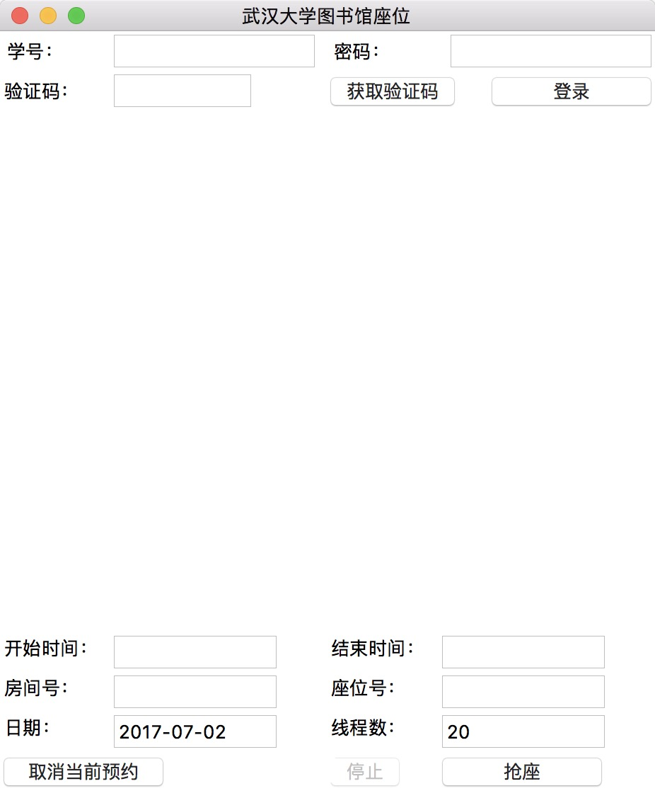

# 武汉大学信息学部图书馆座位预约工具

Author: Haozhe Zhang

Language: Python 2.7

> Online OCR engine based on tesseract-ocr is newly added to help recognize the captcha. 


## Screenshot




## Usage:

### Step1 Run the sript

#### * Mac & Windows

```shell
python main.py
```

#### * Ubuntu

```shell
sudo apt-get install python-tk python-pil
python main.py
```

### Step2 Input the information

Then, Input your username and password, click the button to get captcha, and then sign in.

After you sign in, specify the vaious requirements. Note that you are required to input 21.5 if you want to set time as 21:30.

BTW, if you want to select several seats at the same time, just input all those seat_id splited by comma.(ex. "1,2,3,4" for seat 1~seat4)
